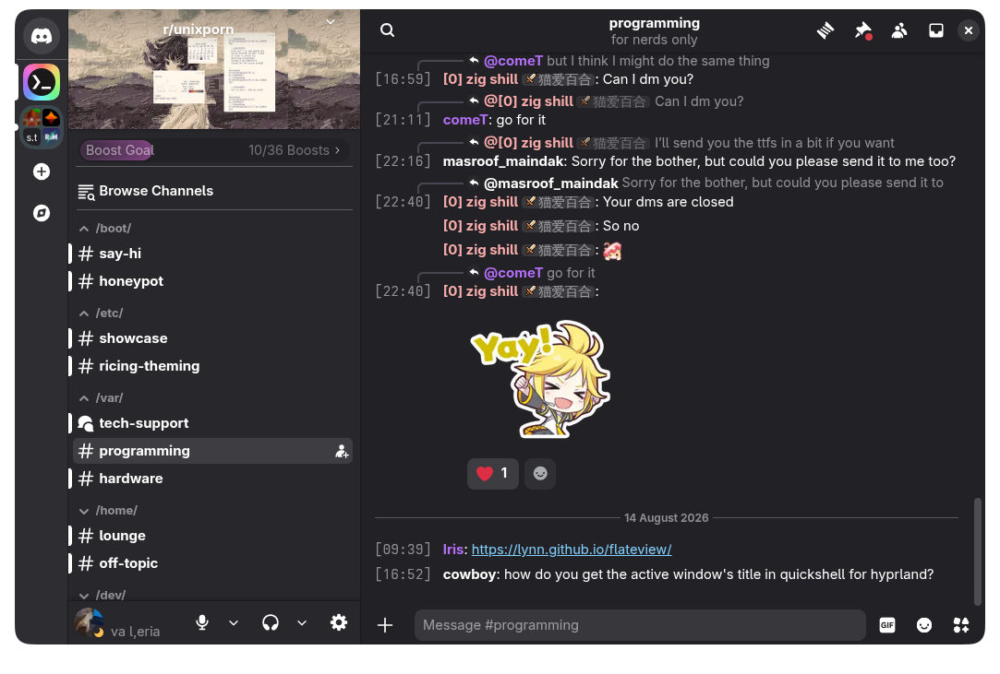

# Adwaita Discord 0.1.0

A modified version of the [`Discord GNOME Theme`](https://github.com/ricewind012/discord-gnome-theme) by [ricewind012](https://github.com/ricewind012), with improved BetterDiscord/Vencord compatibility, multilingual support, and additional UI fixes.



## Bug Reports

I’ve just finished making significant edits to the theme, if you encounter a problem, please [open an issue](https://github.com/kusaida/adwaita-discord/issues) and include a screenshot and, if possible, a description of what is wrong.

## Installation

### BetterDiscord

1. Download [`adwaita.theme.css`](https://github.com/kusaida/adwaita-discord/blob/main/themes/adwaita.theme.css).
2. Open Discord and go to **Settings → Themes**.
3. Click **Open Themes Folder**.
4. Move `adwaita.theme.css` into the themes folder.
5. Enable the theme in Discord.

You can also install it through the [BetterDiscord Theme Store](https://betterdiscord.app/themes) once the theme has been approved.

### Vencord / Vesktop

1. Open **Settings → Themes**.
2. Go to the **Online Themes** section.
3. Add the following URL:

```text
https://raw.githubusercontent.com/kusaida/adwaita-discord/main/themes/adwaita.theme.css
```

4. Enable the theme.

Alternatively, you can download [`adwaita.theme.css`](https://github.com/kusaida/adwaita-discord/blob/main/themes/adwaita.theme.css), place it in your themes folder, and enable it manually.

## Features

- Multilingual support
- BetterDiscord compatibility
- Styling for previously unstyled UI elements
- Various UI and compatibility fixes

## Planned Features

- **Restore some icons**  
  Most icons are currently removed because they were tied to the English localization in the original theme. I plan to restore at least some of them in a localization-independent way.

- **Improve Nitro support**  
  Extend styling for Nitro-related UI elements. This is currently a low priority.

- **Complete UI styling**  
  Finish styling all remaining Discord UI elements and remove the remaining unstyled/default components.

## Credits

Based on [`Discord GNOME Theme`](https://github.com/ricewind012/discord-gnome-theme) by [ricewind012](https://github.com/ricewind012).
